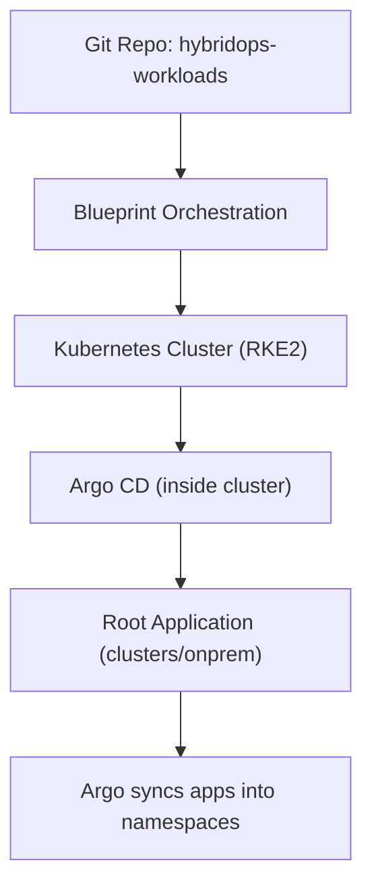

# Argo CD Model

This repo holds workload Applications only.

Argo CD installation and the root Application are created by a module/blueprint.
The root Application should point to `clusters/<target>`.

Flow:
1. Cluster module provisions Kubernetes (for example `platform/onprem/rke2-cluster`).
2. Argo bootstrap module installs Argo CD and creates the root Application.
3. Argo CD syncs the Applications listed in `clusters/<target>`.

Notes:
- This repo targets Kubernetes clusters only.
- Edge services (Thanos, Grafana, Alertmanager, Decision Service) run as system services and are managed outside Argo CD.

## Pattern A - Per-cluster Argo CD (recommended)

Each cluster runs its own Argo CD instance. The blueprint installs Argo CD and creates the root Application.

## Input Contract (keep modules atomic)

Recommended split:
- Cluster module inputs: networking, node inventory, security, runtime settings.
- Argo bootstrap inputs: `workloads_repo_url`, `workloads_revision`, `workloads_target_path`.

Avoid coupling:
- Do not embed workload app manifests in cluster module specs.
- Use blueprints to bind cluster readiness to workload sync.
